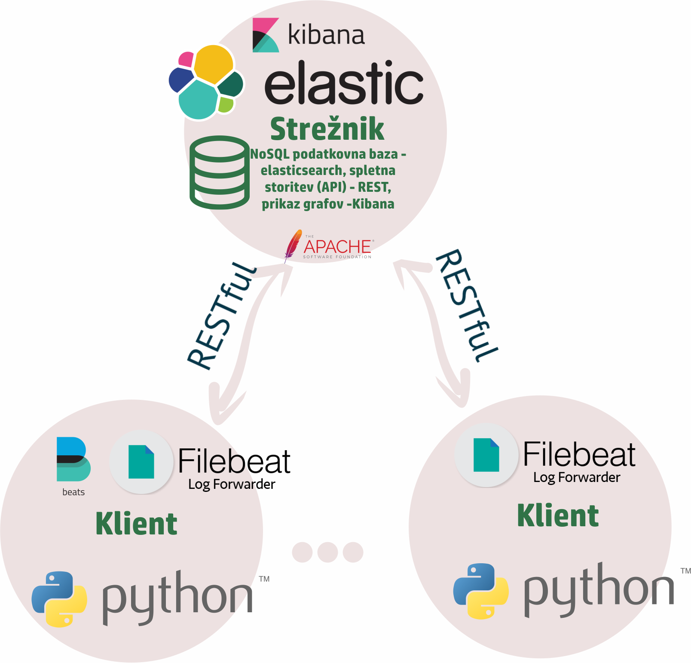

# Bluetooth Low Energy Sniffer
## Namestitev in konfiguracija klienta
Testirano na Windows 10 in RPi. Bi moralo delovati tudi na ostalih platformah.

### Zahteve
* Python3.6 (lahko uporabiš virtualenv, potem potrebno spremeniti shell skripto za poganjanje kot service na RPi-ju in poti)
* Filebeat (glej spodaj za več informacij - namestitev, konfiguracija)
* Metricbeat (opcijsko)

### Arhitektura


### Namestitev aplikacije
Pojdi v direktorij v katerem želiš imeti aplikacijo (tukaj predpostavimo /home/pi/Documents/). Uporabi git ali prenesi iz 
https://gitlab.com/alphiii/Sniffer-IP . Namesti potrebne knjižnice s pip (pip3.6 na RPi-ju).
```
cd /home/pi/Documents/
git clone https://gitlab.com/alphiii/Sniffer-IP.git
cd Sniffer-IP
pip install -r requirements.txt
```

### Namestitev programa kot service na RPi-ju:
1.) Napiši shell skripto za zagon aplikacije npr. `launcher.sh`, ki se nahaja v direktoriju `Sniffer-IP`.
```
sudo nano launcher.sh
```

V skripto dodaj pot do aplikacije in zaženi kot admin.
```
#!/bin/sh

# Start BLE Sniffer service
cd /home/pi/Documents/Sniffer-IP/
sudo /usr/local/bin/python3.6  /home/pi/Documents/Sniffer-IP/sniffer.py 
```
2.) Da se aplikacija zažene ob vsakem bootu
pojdi v `rc.local` in dodaj vrstico za zagon shell skripte v detachted screenu pred `exit 0`.
```
sudo nano /etc/rc.local
```

```
sudo su - pi -c "sudo screen -dm -S sniffer_screen sudo sh /home/pi/Documents/Sniffer-IP/launcher.sh"
```


### Namestitev in konfiguracija filebeat-a (metricbeat-a)
Nameščanje beatov je podobno, tukaj predpostavim da nameščamo filebeat. Če nameščamo beate na Windows, OSX, Linux je 
dosegljiv postopek na https://www.elastic.co/guide/en/beats/filebeat/current/filebeat-installation.html . Če pa želimo 
beate na ARM procesorjih (RPi) sledimo spodnjim navodilom. V obeh primerih je potrebno
nastaviti `filebeat.yml` datoteko. Na vseh platformah samo v primeru filebeata je potrebno določiti še template to narediš tako,
da kopiraš datoteko `filebeat.template.json` iz izvornega direktorja `Sniffer-IP` v direktorij filebeata.

#### Namestitev filebeat-a na RPi-ju
Pojdi na naslov https://beats-nightlies.s3.amazonaws.com/index.html?prefix=jenkins/ in izberi zadnjo verzijo filebeata z imenom
´filebeat-linux-arm´ in kopiraj link datoteke npr. https://beats-nightlies.s3.amazonaws.com/index.html?prefix=jenkins/filebeat/1498-b224a3c41d4d099844f849760107a0b718077216/filebeat-linux-arm . 
Prenesi paket s pomočjo wget, kreairaj direktorije za filebeat in naredi zagonsko datoteko.

```
wget https://beats-nightlies.s3.amazonaws.com/index.html?prefix=jenkins/filebeat/1498-b224a3c41d4d099844f849760107a0b718077216/filebeat-linux-arm
sudo mkdir /opt/filebeat
sudo mkdir /etc/filebeat
sudo mv filebeat-linux-arm /opt/filebeat/
sudo chmod +x /opt/filebeat/filebeat-linux-arm
```

#### Konfiguracija filebeat.yml datoteke
primer Filebeat filebeat.yml datoteke za RPi:
```
filebeat.prospectors:
- input_type: log
  paths:
    - /home/pi/Documents/Sniffer-IP/Logs/ble_service*.log
    - /home/pi/Documents/Sniffer-IP/Logs/scheduler*.log
    - /home/pi/Documents/Sniffer-IP/Logs/ble_packets*.log

  json.keys_under_root: true
  json.add_error_key: true
  json.overwrite_keys: true

#-------------------------- Elasticsearch output ------------------------------

output.elasticsearch:
  hosts: ["https://blesniffer.ddns.net:9200"]
  template.name: "filebeat"
  template.path: "filebeat.template.json"
  template.overwrite: false

  # Optional protocol and basic auth credentials.
  protocol: "https"
  username: "elastic"
  password: "blesnifferpw"
```
V primeru Windows platforme spremenimo poti logov v npr. `- C:\My documents\Sniffer-IP\Logs\scheduler*.log`. Pri hosts uporabimo
naslov IP ali domeno elasticsearcha.

#### Filebeat kot service na RPi-ju
Filebeat želimo zagnati ob vsakem bootu, zato ga dodamo v sistemski service.

```
cd /lib/systemd/system
sudo nano filebeat.service
```
Dodamo sledeče:
```
[Unit]
Description=filebeat
Documentation=https://www.elastic.co/guide/en/beats/filebeat/current/index.html
Wants=network-online.target
After=network-online.target

[Service]
ExecStart=/opt/filebeat/filebeat-linux-arm -c /etc/filebeat/filebeat.yml
Restart=always

[Install]
WantedBy=multi-user.target
```

Zaženemo storitev.
```
systemctl enable filebeat
sudo service filebeat start
```

Konfiguracija metricbeat-a je podobna, spremeniti je potrebno le yml 
datoteko več na: https://www.elastic.co/guide/en/beats/metricbeat/current/metricbeat-installation.html

## Zgrajeno s pomočjo
* [Adafruit Sniffer API](https://github.com/adafruit/Adafruit_BLESniffer_Python) - Python API
* [Elasticsearch](https://github.com/adafruit/Adafruit_BLESniffer_Python) - Search engine/Podatkovna baza + Filebeat, Metricbeat

## Sodelujoči

* **Blaž Bider** - *Razvoj projekta* 
* **Matevž Pustišek** - *Mentor*
* **Luka Mali** - *Mentor* 
* **Andrej Kos** - *Nosilec predmeta* 
